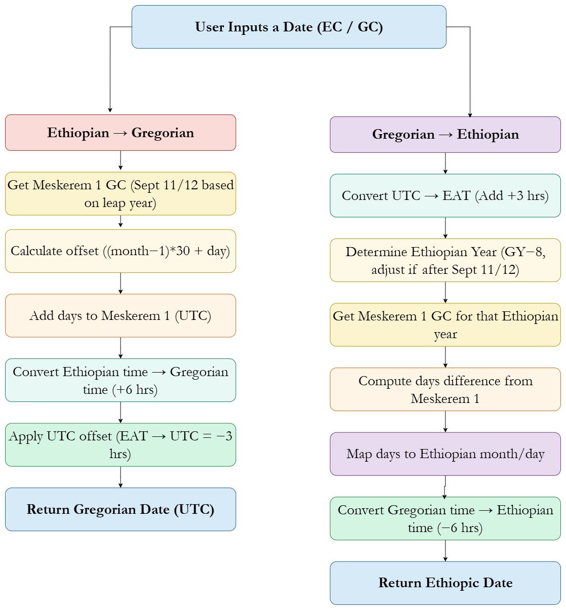

# 🗓️ Ethiopian Calendar Converter — Finova Edition

 
 
 


📅 Cross-platform **Ethiopian (Ethiopic) calendar** conversion and formatting with **internationalization (i18n)**:

- 🌍 **Supported Languages**:
  - **Amharic (am)**
  - **Afaan Oromo (om)**
  - **Somali (so)**
  - **English (en, transliterations)**

✅ Works in:
- Browser  
- Node.js  
- Deno  
- React Native  

⚡ Built with **TypeScript**, tested with **Vitest**, and bundled via **tsup**.

---

## 📦 Installation

```bash
npm i ethiopian-calendar-finova
```

---

## 📖 Documentation

👉 [Read the full docs on npm](https://www.npmjs.com/package/ethiopian-calendar-finova)

---

## 🚀 Features

- Convert between **Ethiopian ↔ Gregorian** dates  
- Format dates with **localization (i18n)**  
- Lightweight and **tree-shakable**  
- Zero external dependencies  

---

## 🧠 Conversion Logic

### Ethiopian → Gregorian Conversion
1. Determine **Meskerem 1** in Gregorian (Sept 11 or 12 depending on leap year)  
2. Calculate day offset:  
   ```
   offset = (month - 1) * 30 + day
   ```
3. Add the offset to Meskerem 1  
4. Adjust time (EAT → UTC = −3 hrs)  
5. Return converted Gregorian date  

### Gregorian → Ethiopian Conversion
1. Identify **Meskerem 1** in Gregorian for the given year  
2. Compute days difference from Meskerem 1  
3. Determine Ethiopian month/day from that difference  
4. Adjust time (UTC → EAT = +3 hrs)  
5. Return converted Ethiopian date  

---

## 🧩 Flow Diagram
<p align="center">
  
</p>
---

## 📜 License

[MIT](./LICENSE)

---

> ✨ “Bridging timelines — preserving tradition with technology.”  
> *Ethiopian Calendar Finova © 2025 — All Rights Reserved.*
